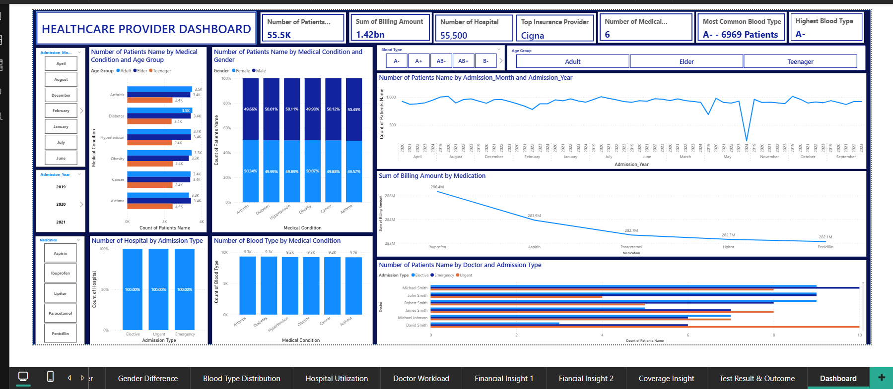

# PROJECT DESCRIPTION
An interactive healthcare analytics dashboard built to analyze patient demographics, medical conditions, admission trends, billing performance, insurance coverage, blood types, and doctor workload. The project delivers actionable insights to support efficient healthcare operations and data-driven decision-making.
# PROJECT RECOGNITION
This project contributed to my selection as a finalist for the Data Science Nigeria (DSN) Bootcamp 2025, where I was selected among 150 finalists out of over 30,000 applicants nationwide.
# INTRODUCTION
Healthcare providers generate large volumes of data daily, ranging from patient demographics and medical conditions to billing, insurance coverage, and hospital utilization. However, without effective analytics and visualization, extracting actionable insights from this data becomes challenging.
This project presents a Healthcare Provider Dashboard designed to provide data-driven insights into patient distribution, medical conditions, hospital admissions, billing performance, insurance coverage, and doctor workload. The dashboard supports informed decision-making for healthcare administrators, policy makers, and financial managers.
## Project Objectives
The primary objectives of this project are to:
1.	Analyze patient distribution across medical conditions, age groups, gender, and blood types.
2.	Evaluate hospital utilization by admission type and time trends.
3.	Assess financial performance through billing amounts and medication costs.
4.	Identify dominant insurance providers and coverage trends.
5.	Understand doctor workload and patient assignment patterns.
6.	Support operational efficiency and strategic healthcare planning.
## Dataset Overview

[Interact with the live Dashboard here](https://app.powerbi.com/groups/me/reports/92cada64-3ceb-4205-92e4-406406abe086/ReportSectioned708e995827ea2b2e84?experience=power-bi)
## The dataset used in this project includes healthcare records containing:
- Patient demographics (Age group, Gender, Blood type)
- Medical conditions (e.g., Arthritis, Diabetes, Hypertension, Cancer, Asthma, Obesity)
- Admission details (Admission type, Admission month, and year)
- Hospital and doctor information
- Billing amounts and medications
- Insurance provider details
The dataset was cleaned, transformed, and modeled to ensure accuracy and consistency for analysis.
## Tools & Technologies
- Power BI – Data modeling, visualization, and dashboard creation
- Microsoft Excel – Initial data cleaning and preprocessing
- DAX – Measures and calculated fields
- GitHub – Project documentation and version control
## Dashboard Overview
The dashboard is structured into several key analytical sections:
🔹 KPI Summary Cards
- Total Patients: 55.5K
- Total Billing Amount: ₦1.42bn
- Number of Hospitals: 55,500
- Top Insurance Provider: Cigna
- Number of Medical Conditions: 6
- Most Common Blood Type: A- (6,969 patients)
These KPIs provide an immediate snapshot of healthcare scale and performance.
## Key Insights & Analysis
### 1️⃣ Patient Distribution by Medical Condition & Age Group
- Arthritis, Diabetes, and Hypertension show the highest patient volumes across all age groups.
- Adult patients dominate across most medical conditions, followed by Elderly patients.
- Teenagers represent the smallest patient segment, indicating lower hospital utilization in this group.
Insight: Chronic diseases contribute significantly to healthcare demand, particularly among adults and elders.
### 2️⃣ Medical Conditions by Gender
- Gender distribution across medical conditions is nearly balanced, with males and females each contributing approximately 50%.
- No significant gender bias was observed in disease prevalence.
Insight: Healthcare resource allocation should remain gender-neutral while focusing on condition severity rather than gender prevalence.
### 3️⃣ Blood Type Distribution
- Blood type A- is the most common among patients.
- Blood type distribution remains relatively consistent across different medical conditions.
Insight: Blood inventory planning can prioritize dominant blood groups while maintaining adequate reserves for rare types.
### 4️⃣ Admission Trends Over Time
- Patient admissions show seasonal fluctuations across months and years.
- Certain months record noticeable drops, indicating possible external factors such as policy changes, epidemics, or reporting gaps.
Insight: Temporal trends can support staffing, budgeting, and capacity planning.
### 5️⃣ Hospital Utilization by Admission Type
- Admission types (Elective, Urgent, Emergency) show equal hospital participation, indicating balanced service offerings across hospitals.
Insight: Hospitals maintain readiness across all admission categories, supporting comprehensive healthcare delivery.
### 6️⃣ Financial Performance by Medication
- Ibuprofen records the highest billing amount, followed by Aspirin and Paracetamol.
- Medication-related costs contribute significantly to total healthcare expenditure.
Insight: Cost optimization strategies can focus on high-billing medications without compromising patient care.
### 7️⃣ Doctor Workload Analysis
- Patient distribution across doctors varies by admission type.
- Some doctors manage significantly higher emergency and urgent cases, indicating uneven workload distribution.
Insight: Doctor workload balancing can improve service quality and reduce burnout.
## Business & Healthcare Impact
This dashboard enables healthcare decision-makers to:
- Optimize resource allocation and staffing
- Improve financial forecasting and cost control
- Enhance patient care planning
- Identify high-impact medical conditions
- Support policy and strategic healthcare decisions
## Recommendations
1.	Expand Real-Time Data Integration
Incorporate live hospital data for real-time decision-making.
2.	Predictive Analytics
### Apply forecasting models to predict admissions, billing trends, and medication demand.
3.	Doctor Load Optimization
### Use workload metrics to balance patient assignments.
4.	Cost Control Strategies
### Analyze high-cost medications and explore alternatives where appropriate.
5.	Enhanced Patient Outcome Tracking
### Integrate recovery and treatment success metrics for holistic healthcare analysis.
## Conclusion
The Healthcare Provider Dashboard successfully transforms complex healthcare data into actionable insights. By combining patient demographics, medical conditions, financial metrics, and operational performance, the dashboard provides a comprehensive view of healthcare delivery. This project demonstrates the power of data analytics in improving efficiency, reducing costs, and supporting better healthcare outcomes.
## About the Author
### Folagbade Olatunbosun Samuel
Data Analyst | Business Analyst | Healthcare Analytics Enthusiast
- Skilled in data visualization, analytics, and business intelligence
- Passionate about using data to drive impactful decisions
- Tools: Power BI, Excel, SQL (if applicable)
- 💼 LinkedIn:https://www.linkedin.com/in/olatunbosun-folagbade-559151243/
- 📧 Email:Folagbadeolatunbosun@gmail.com
